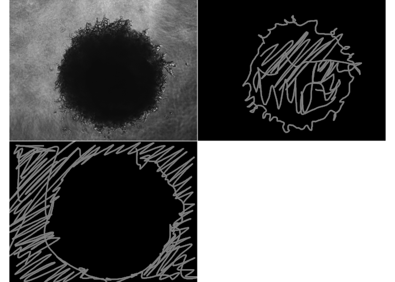

<!-- README.md is generated from README.Rmd. Please edit that file -->

# clasifierrr

<!-- badges: start -->

<!-- badges: end -->

## Motivation

The goal of clasifierrr is to … classify image regions using R.

In my field of study, there are many cases where one has a lot of images
that require classification. Whether it is counting cells, quantifying
areas in IHC, counting dots in cells, measuring spheroid sizes … And it
would be nice to automate those tasks.

Nonetheless, many of those classification parameters are
experiment-specific, making a generalized classifier inpractical. In
addition, the number of images is usually enough to be extremely tedious
to work out by a human but not enough to train a neural network.

clasifierrr takes care of those cases, where small datasets are used to
build a clasification algorithm and allow the user to deploy it on many
images.

## Installation

``` r
remotes::install_github("jspaezp/clasifierrr")
```

## Workflow

1.  Externally create the masking files for the classification
2.  Internally create a parameters data frame
3.  use `build_train_multi` to create the training dataset
4.  use `ranger` to train the classifier
5.  use `classify_img` to classify as many images as you want
6.  (optional) use `filter_masks` to remove objects that are too small
    or too big

## Example

``` r
library(clasifierrr)
library(EBImage)
library(ranger)
## basic example code
## 
## 
params_df <- tibble::tibble(
    file = c(
        system.file(
            "extdata", "tiny_4T1-shNT-1_layer1.png",
            package = "clasifierrr"),
        system.file(
            "extdata", "tiny_4T1-shNT-1_layer2.png",
            package = "clasifierrr")),
    classif = c("spheroid", "bg"),
    related_file = system.file(
        "extdata", "tiny_4T1-shNT-1.png",
        package = "clasifierrr")
)

params_df
#> # A tibble: 2 x 3
#>   file                              classif related_file                        
#>   <chr>                             <chr>   <chr>                               
#> 1 /home/jspaezp/R/x86_64-redhat-li… sphero… /home/jspaezp/R/x86_64-redhat-linux…
#> 2 /home/jspaezp/R/x86_64-redhat-li… bg      /home/jspaezp/R/x86_64-redhat-linux…
```

### Form of the classifier files

It has to be a file of the same size of the related image, where it is
all black except for the desired classifier section.

Several classifications can be used.

I personally use gimp to generate those, just open the image you want to
classify, draw on a new layer, disable the main layer and export to a
png.

``` r
base_image <- readImageBw(params_df[[3]][[1]])
display(
  EBImage::combine(
    base_image,
    readImageBw(params_df[[1]][[1]]),
    readImageBw(params_df[[1]][[2]])),
  method = "raster", all = TRUE)
```



### Calculating Features

The classifier is based on the concept of features, which is applying
several filters to the image to detect edges and calculate the
consistency with the neighborhood.

you can use as many filters as you want but THE FILTER WIDTHS HAVE TO BE
ODD NUMBERS, also consider that the more filters, the more memmory you
will need.

``` r
features <- calc_features(base_image, filter_widths = c(3,5))
#> 
#> Attaching package: 'purrr'
#> The following object is masked from 'package:EBImage':
#> 
#>     transpose
head(features, 2)
#> # A tibble: 2 x 8
#>   gauss_filt_3 gauss_filt_5 DoG_filt_3 DoG_filt_5 var_filt_3 var_filt_5
#>          <dbl>        <dbl>      <dbl>      <dbl>      <dbl>      <dbl>
#> 1        0.486        0.458   -3.94e-9    -0.0283    0.00420    0.00455
#> 2        0.490        0.469   -3.05e-9    -0.0209    0.00337    0.00360
#> # … with 2 more variables: sobel_filt_3 <dbl>, sobel_filt_5 <dbl>
```

Each of the columns can be made to an image

``` r
display_filters(features, dims = dim(base_image), scale = TRUE)
```


### Building a training dataset from the files

The program goes in to the files, generates the features form the base
image and assigns a classification to the pixles that overlap with the
region you defined in the “classifier files” (the ones that look like
squigly lines)

``` r
trainset <- build_train_multi(params_df, filter_widths = c(3,5))
#> Returning for file:  /home/jspaezp/R/x86_64-redhat-linux-gnu-library/3.6/clasifierrr/extdata/tiny_4T1-shNT-1_layer1.png and classification" spheroid " a total of { 8556 } positive pixels
#> Returning for file:  /home/jspaezp/R/x86_64-redhat-linux-gnu-library/3.6/clasifierrr/extdata/tiny_4T1-shNT-1_layer2.png and classification" bg " a total of { 14056 } positive pixels
#> Warning in build_train(feat_img = calc_features(preprocess_fun_img(readImageBw(.x)), : The selected train size(50000) is larger than the number of classified pixels (22567)  so the number is getting updated to the total number of available pixels
#> Classified objects are of classes {bg: 14056} and {spheroid: 8511}
#> Returning a data frame of 22567 rows and 9 columns
head(trainset)
#>   gauss_filt_3 gauss_filt_5    DoG_filt_3    DoG_filt_5   var_filt_3
#> 1   0.51372549   0.51264245 -1.791763e-10 -1.083042e-03 4.577748e-05
#> 2   0.24705882   0.24500235 -2.986271e-10 -2.056473e-03 4.400544e-05
#> 3   0.30588235   0.30818717  2.986270e-10  2.304817e-03 2.444412e-03
#> 4   0.04313725   0.04318191 -5.056285e-18  4.465888e-05 9.282069e-07
#> 5   0.05098039   0.05018796 -1.194508e-10 -7.924294e-04 3.670636e-06
#> 6   0.04705882   0.04780730  1.194508e-10  7.484737e-04 1.329023e-06
#>     var_filt_5 sobel_filt_3 sobel_filt_5 pixel_class
#> 1 1.792853e-04  0.099826840   0.47496332          bg
#> 2 1.678721e-04  0.012401089   0.28008347          bg
#> 3 3.960448e-03  0.094280904   2.45943639          bg
#> 4 1.624055e-06  0.005545936   0.01240109    spheroid
#> 5 3.334460e-06  0.005545936   0.01568627    spheroid
#> 6 1.466299e-06  0.017537788   0.03529412    spheroid
```

### Train a classifier

Here we use any “machine learning” algorithm as our classifier. I really
like ranger, so that is what I will recommend.

``` r
classifier <- ranger(
    pixel_class ~ .,
    data = trainset, 
    num.trees = 100, 
    importance = "impurity", 
    min.node.size = 5, 
    max.depth = 200)
classifier
#> Ranger result
#> 
#> Call:
#>  ranger(pixel_class ~ ., data = trainset, num.trees = 100, importance = "impurity",      min.node.size = 5, max.depth = 200) 
#> 
#> Type:                             Classification 
#> Number of trees:                  100 
#> Sample size:                      22567 
#> Number of independent variables:  8 
#> Mtry:                             2 
#> Target node size:                 5 
#> Variable importance mode:         impurity 
#> Splitrule:                        gini 
#> OOB prediction error:             1.84 %
```

If the classifier was trained using `importance = "impurity"`, you can
ask it to give you the relative importance of the variables used.

``` r
sort(ranger::importance(classifier), decreasing = TRUE)
#> gauss_filt_3 gauss_filt_5   var_filt_3   var_filt_5 sobel_filt_3 sobel_filt_5 
#>    2791.7176    2626.9225    1500.1604    1442.9067     936.2210     824.4162 
#>   DoG_filt_3   DoG_filt_5 
#>     208.3463     191.6925
```

### Using the classifier on an image

The `classify_img` has an interface for many kinds of inputs depending
on what you have planned.

It Can be used directly on calculated features …

``` r
# This just reads the image to classify
test_img <- readImageBw(system.file(
        "extdata", "tiny_4T1-shNT-1.png",
        package = "clasifierrr"))

test_feat <- calc_features(test_img, filter_widths = c(3,5))

class_img <- classify_img(
    classifier, 
    feature_frame = test_feat, 
    dims = dim(test_img), 
    class_highlight = "spheroid")
#> Starting classification
#> Took 0.3735 secs to predict the image
display(class_img, method = "raster")
```


It can also be used on a raw image …

``` r
class_img <- classify_img(
  classifier, 
  img = test_img, 
  filter_widths = c(3,5))
#> Attempting to calculate features
#> Starting classification
#> Took 0.4819 secs to predict the image
#> Warning in classify_img(classifier, img = test_img, filter_widths = c(3, : Found in the final classification {12665} values more than 1 and {0} values less than 0, This might be undesired in the final image and lead to inconsistencies
# display(colorLabels(class_img), method = "raster")
```

And as well in a system file

``` r
class_img <- classify_img(
  classifier,
  path = system.file(
    "extdata", "tiny_4T1-shNT-1.png",
    package = "clasifierrr"),
  filter_widths = c(3,5), 
  class_highlight = "spheroid")
#> Attempting to read image from file/home/jspaezp/R/x86_64-redhat-linux-gnu-library/3.6/clasifierrr/extdata/tiny_4T1-shNT-1.png
#> Attempting to calculate features
#> Starting classification
#> Took 0.647 secs to predict the image

# display(class_img, method = "raster")
```

### Cleaning the final image

The final image can be cleaned manually or using `filter_masks`, which
can remove stuff either too big or small.

As a reminder, white regions are considered objects, so if your object
is black, try running something like `img <- 1- img`

``` r
filt_class_img <- filter_masks(min_radius = 10, max_radius = Inf, mask = class_img)

display(filt_class_img, method = "raster")
```


``` r
table(filt_class_img)
#> filt_class_img
#>     0     1 
#> 19349 12221
filt_class_img
#> Image 
#>   colorMode    : Grayscale 
#>   storage.mode : integer 
#>   dim          : 205 154 
#>   frames.total : 1 
#>   frames.render: 1 
#> 
#> imageData(object)[1:5,1:6]
#>      [,1] [,2] [,3] [,4] [,5] [,6]
#> [1,]    0    0    0    0    0    0
#> [2,]    0    0    0    0    0    0
#> [3,]    0    0    0    0    0    0
#> [4,]    0    0    0    0    0    0
#> [5,]    0    0    0    0    0    0
```
