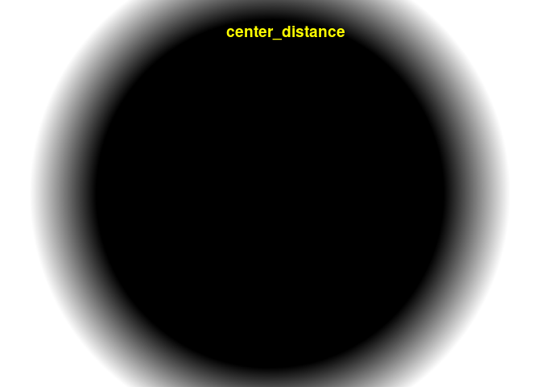

<!-- README.md is generated from README.Rmd. Please edit that file -->

# clasifierrr

<!-- badges: start -->

<!-- badges: end -->

The goal of clasifierrr is to …

## Installation

``` r
remotes::install_github("jspaezp/clasifierrr")
```

## Workflow

1.  Externally create the masking files for the classification
2.  Internally create a parameters data frame
3.  use `build_train_multi` to create the training dataset
4.  use `ranger` to train the classifier
5.  use `classify_img` to classify as many images as you want
6.  (optional) use `filter_masks` to remove objects that are too small
    or too big

## Example

``` r
library(clasifierrr)
library(EBImage)
library(ranger)
## basic example code
## 
## 
params_df <- tibble::tibble(
    file = c(
        system.file(
            "extdata", "4T1-shNT-1_layer1.png",
            package = "clasifierrr"),
        system.file(
            "extdata", "4T1-shNT-1_layer2.png",
            package = "clasifierrr")),
    classif = c("spheroid", "bg"),
    related_file = system.file(
        "extdata", "4T1-shNT-1.png",
        package = "clasifierrr")
)

params_df
#> # A tibble: 2 x 3
#>   file                              classif  related_file                       
#>   <chr>                             <chr>    <chr>                              
#> 1 /tmp/RtmpTBYABc/temp_libpath38ff… spheroid /tmp/RtmpTBYABc/temp_libpath38ff68…
#> 2 /tmp/RtmpTBYABc/temp_libpath38ff… bg       /tmp/RtmpTBYABc/temp_libpath38ff68…
```

### Form of the classifier files

It has to be a file of the same size of the related image, where it is
all black except for the desired classifier section.

Several classifications can be used.

I personally use gimp to generate those, just open the image you want to
classify, draw on a new layer, disable the main layer and export to a
png.

``` r
display(readImageBw(system.file(
            "extdata", "4T1-shNT-1_layer1.png",
            package = "clasifierrr")), method = "raster")
```


``` r

display(readImageBw(system.file(
            "extdata", "4T1-shNT-1_layer2.png",
            package = "clasifierrr")), method = "raster")
```


``` r

base_image <- readImageBw(system.file(
            "extdata", "4T1-shNT-1.png",
            package = "clasifierrr"))
display(base_image, method = "raster")
```


The classifier is based on the concept of features, which is applying
several filters to the image to detect edges and calculate the
consistency with the neighborhood.

you can use as many filters as you want but THE FILTER WIDTHS HAVE TO BE
ODD NUMBERS, also consider that the more filters, the more memmory you
will need.

``` r
features <- calc_features(base_image, filter_widths = c(3,5))
head(features)
#> # A tibble: 6 x 8
#>   sobel_filt_3[,1] sobel_filt_5[,1] gauss_filt_3[,1] gauss_filt_5[,1]
#>              <dbl>            <dbl>            <dbl>            <dbl>
#> 1          -0.557            -0.367            0.760            0.760
#> 2          -0.310            -0.436            0.760            0.760
#> 3          -0.196            -0.480            0.759            0.759
#> 4          -0.289            -0.480            0.740            0.740
#> 5          -0.119            -0.220            0.741            0.741
#> 6           0.0160           -0.120            0.817            0.817
#> # … with 4 more variables: gauss_diff_3[,1] <dbl>, y_position[,1] <dbl>,
#> #   x_position[,1] <dbl>, center_distance[,1] <dbl>
```

Each of the columns can be made to an image

``` r
for (i in names(features)) {
    reconstructed_image <- Image(features[[i]], dim(base_image))
    display(reconstructed_image, method = "raster")
    title(main = list(i, col = "yellow"))
}
```



``` r
trainset <- build_train_multi(params_df)
#> [1] "Returning for file:  /tmp/RtmpTBYABc/temp_libpath38ff6836db2f/clasifierrr/extdata/4T1-shNT-1_layer1.png and classification spheroid a total of 108470 positive pixels"
#> [1] "Returning for file:  /tmp/RtmpTBYABc/temp_libpath38ff6836db2f/clasifierrr/extdata/4T1-shNT-1_layer2.png and classification bg a total of 205401 positive pixels"
#> Classified objects are of classesbg: 32678 and spheroid: 17322
#> Returning a data frame of 50000 rows and 15 columns
head(trainset)
#>   sobel_filt_3 sobel_filt_5 sobel_filt_11 sobel_filt_23 gauss_filt_3
#> 1   0.43675232    0.5100518   -0.19673294   -0.65885641    1.0689509
#> 2  -0.13756478    0.6463246    0.06325151    0.02320576    1.9334536
#> 3   5.24739504    3.4083039    1.11402828    0.81809259    1.6595567
#> 4  -0.61424932   -0.7273131   -0.81245826   -0.77734083   -1.3177194
#> 5  -0.13756478   -0.2313433   -0.30813884    0.20865437   -0.7593949
#> 6   0.01599249    0.2632203    0.27580972   -0.15015858    0.7788476
#>   gauss_filt_5 gauss_filt_11 gauss_filt_23 gauss_diff_3 gauss_diff_5
#> 1    1.0689509     1.0689509     1.0689509   1.16590749  -2.08878137
#> 2    1.9334536     1.9334536     1.9334536   0.05478742  -2.08878137
#> 3    1.6595567     1.6595567     1.6595567  -5.86853879   0.17093916
#> 4   -1.3177194    -1.3177194    -1.3177194   0.10557501  -0.06444840
#> 5   -0.7593949    -0.7593949    -0.7593949   1.33997251   0.17093916
#> 6    0.7788476     0.7788476     0.7788476   0.32325951  -0.01737089
#>   gauss_diff_11  y_position  x_position center_distance pixel_class
#> 1     0.7988051 -0.59032240 -0.95905532      -0.2454644          bg
#> 2    -0.4112113 -1.59842993  0.84741925       0.6743291          bg
#> 3    -1.3187236 -1.37177488  0.02198892      -0.3046256          bg
#> 4    -0.5813699 -0.09980028  0.56663763      -1.3277757    spheroid
#> 5     0.4206750  0.86771231 -0.64782749      -0.5566580    spheroid
#> 6    -0.2599593  0.82711738 -1.04362810       0.1038682          bg
```

``` r
classifier <- ranger(
    pixel_class ~ .,
    data = trainset, 
    num.trees = 100, 
    importance = "impurity")
classifier
#> Ranger result
#> 
#> Call:
#>  ranger(pixel_class ~ ., data = trainset, num.trees = 100, importance = "impurity") 
#> 
#> Type:                             Classification 
#> Number of trees:                  100 
#> Sample size:                      50000 
#> Number of independent variables:  14 
#> Mtry:                             3 
#> Target node size:                 1 
#> Variable importance mode:         impurity 
#> Splitrule:                        gini 
#> OOB prediction error:             0.14 %
```

If the classifier was trained using `importance = "impurity"`, you can
ask it to give you the relative importance of the variables used.

``` r
sort(ranger::importance(classifier), decreasing = TRUE)
#>    gauss_filt_3   gauss_filt_11   gauss_filt_23    gauss_filt_5 center_distance 
#>      3700.48259      3510.06428      3480.30973      2969.41806      2939.17561 
#>   sobel_filt_11    sobel_filt_3   sobel_filt_23    sobel_filt_5      x_position 
#>      1383.82127      1366.75224      1341.87315       878.82853       560.65658 
#>      y_position    gauss_diff_3   gauss_diff_11    gauss_diff_5 
#>       267.43261       215.24016        19.79329        16.46417
```

### Using the classifier on an image

Can be used directly on calculated features …

``` r
test_img <- readImageBw(system.file(
        "extdata", "4T1-shNT-1.png",
        package = "clasifierrr"))

test_feat <- calc_features(test_img)
class_img <- classify_img(
    classifier, 
    feature_frame = test_feat, 
    dims = dim(test_img))
#> Starting classification
#> Took 18.33 secs to predict the image
display(class_img, method = "raster")
```


It can also be used on a raw image …

``` r
class_img <- classify_img(classifier, img = test_img)
#> Attempting to calculate features
#> Starting classification
#> Took 19.85 secs to predict the image
display(class_img, method = "raster")
```


And as well in a system file

``` r
class_img <- classify_img(classifier, path = system.file(
        "extdata", "4T1-shNT-1.png",
        package = "clasifierrr"))
#> Attempting to read image from file
#> Attempting to calculate features
#> Starting classification
#> Took 13.45 secs to predict the image
display(class_img, method = "raster")
```


### Cleaning the final image

The final image can be cleaned manually or using `filter_masks`, which
can remove stuff either too big or small.

As a reminder, white regions are considered objects, so if your object
is black, try running something like `img <- 1-
img`

``` r
display(dilate(class_img, makeBrush(3, "disc")), method = "raster")
```


``` r
display(colorLabels(bwlabel(class_img)), method = "raster")
```


``` r
filt_class_img <- filter_masks(class_img, min_radius = 30, max_radius = 1000)

display(
    filt_class_img,
    method = "raster")

display(colorLabels(bwlabel(filt_class_img)), method = "raster")
```


``` r

table(filt_class_img)
#> filt_class_img
#>      0      1 
#> 309124 477308

filt_class_img
#> Image 
#>   colorMode    : Grayscale 
#>   storage.mode : integer 
#>   dim          : 1024 768 
#>   frames.total : 1 
#>   frames.render: 1 
#> 
#> imageData(object)[1:5,1:6]
#>      [,1] [,2] [,3] [,4] [,5] [,6]
#> [1,]    1    1    1    1    1    1
#> [2,]    1    1    1    1    1    1
#> [3,]    1    1    1    1    1    1
#> [4,]    1    1    1    1    1    1
#> [5,]    1    1    1    1    1    1
```
