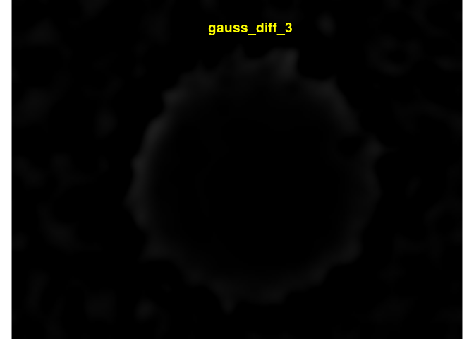

<!-- README.md is generated from README.Rmd. Please edit that file -->

# clasifierrr

<!-- badges: start -->

<!-- badges: end -->

The goal of clasifierrr is to …

## Installation

``` r
remotes::install_github("jspaezp/clasifierrr")
```

## Workflow

1.  Externally create the masking files for the classification
2.  Internally create a parameters data frame
3.  use `build_train_multi` to create the training dataset
4.  use `ranger` to train the classifier
5.  use `classify_img` to classify as many images as you want
6.  (optional) use `filter_masks` to remove objects that are too small
    or too big

## Example

``` r
library(clasifierrr)
library(EBImage)
library(ranger)
## basic example code
## 
## 
params_df <- tibble::tibble(
    file = c(
        system.file(
            "extdata", "tiny_4T1-shNT-1_layer1.png",
            package = "clasifierrr"),
        system.file(
            "extdata", "tiny_4T1-shNT-1_layer2.png",
            package = "clasifierrr")),
    classif = c("spheroid", "bg"),
    related_file = system.file(
        "extdata", "tiny_4T1-shNT-1.png",
        package = "clasifierrr")
)

params_df
#> # A tibble: 2 x 3
#>   file                              classif related_file                        
#>   <chr>                             <chr>   <chr>                               
#> 1 /tmp/RtmpMTOUXX/temp_libpath3a27… sphero… /tmp/RtmpMTOUXX/temp_libpath3a27b4c…
#> 2 /tmp/RtmpMTOUXX/temp_libpath3a27… bg      /tmp/RtmpMTOUXX/temp_libpath3a27b4c…
```

### Form of the classifier files

It has to be a file of the same size of the related image, where it is
all black except for the desired classifier section.

Several classifications can be used.

I personally use gimp to generate those, just open the image you want to
classify, draw on a new layer, disable the main layer and export to a
png.

``` r
display(readImageBw(system.file(
            "extdata", "tiny_4T1-shNT-1_layer1.png",
            package = "clasifierrr")), method = "raster")
```


``` r

display(readImageBw(system.file(
            "extdata", "tiny_4T1-shNT-1_layer2.png",
            package = "clasifierrr")), method = "raster")
```


``` r

base_image <- readImageBw(system.file(
            "extdata", "tiny_4T1-shNT-1.png",
            package = "clasifierrr"))
display(base_image, method = "raster")
```


The classifier is based on the concept of features, which is applying
several filters to the image to detect edges and calculate the
consistency with the neighborhood.

you can use as many filters as you want but THE FILTER WIDTHS HAVE TO BE
ODD NUMBERS, also consider that the more filters, the more memmory you
will need.

``` r
features <- calc_features(base_image, filter_widths = c(3,5))
#> Starting to calculate features for image of width 154 and height 205
#> Filters of size: {3,5}
#> 
#> Attaching package: 'purrr'
#> The following object is masked from 'package:EBImage':
#> 
#>     transpose
#> 
#> Took 0.56 secs to calculate the 7 features for 31570 pixels
head(features, 2)
#>   gauss_filt_3 gauss_filt_5 gauss_diff_3  var_filt_3  var_filt_5 sobel_filt_3
#> 1    0.4868591    0.4882913  0.002864240 0.002066252 0.003918570   0.11379308
#> 2    0.4860857    0.4887673  0.005363217 0.001608498 0.005823959   0.09180157
#>   sobel_filt_5
#> 1    0.1305947
#> 2    0.3050769
```

Each of the columns can be made to an image

``` r
for (i in names(features)) {
    reconstructed_image <- Image(features[[i]], dim(base_image))
    display(reconstructed_image, method = "raster")
    title(main = list(i, col = "yellow"))
}
```



``` r
trainset <- build_train_multi(params_df, filter_widths = c(3,5))
#> Returning for file:  /tmp/RtmpMTOUXX/temp_libpath3a27b4cc15e62/clasifierrr/extdata/tiny_4T1-shNT-1_layer1.png and classification" spheroid " a total of { 8556 } positive pixels
#> Returning for file:  /tmp/RtmpMTOUXX/temp_libpath3a27b4cc15e62/clasifierrr/extdata/tiny_4T1-shNT-1_layer2.png and classification" bg " a total of { 14056 } positive pixels
#> Starting to calculate features for image of width 154 and height 205
#> Filters of size: {3,5}
#> 
#> Took 0.15 secs to calculate the 7 features for 31570 pixels
#> Warning in build_train(feat_img = calc_features(preprocess_fun_img(readImageBw(.x)), : The selected train size(50000) is larger than the number of classified pixels (22567)  so the number is getting updated to the total number of available pixels
#> Classified objects are of classesbg: 14056 and spheroid: 8511
#> Returning a data frame of 22567 rows and 8 columns
head(trainset)
#>   gauss_filt_3 gauss_filt_5 gauss_diff_3   var_filt_3   var_filt_5 sobel_filt_3
#> 1   0.36969509   0.36104371  -0.01730276 6.290078e-04 4.928438e-03   0.05022058
#> 2   0.54460015   0.50530190  -0.07859650 6.385009e-04 1.977540e-03   0.02480218
#> 3   0.25573134   0.26169178   0.01192088 5.828717e-04 2.084354e-03   0.01240109
#> 4   0.06396594   0.06942185   0.01091181 1.101191e-05 8.355412e-05   0.01999615
#> 5   0.38467795   0.39165221   0.01394852 1.919300e-03 6.509166e-03   0.16785047
#> 6   0.59328619   0.57249964  -0.04157310 9.181654e-04 5.212333e-03   0.10316036
#>   sobel_filt_5 pixel_class
#> 1   0.15612572          bg
#> 2   0.19474053          bg
#> 3   0.33993463          bg
#> 4   0.07543288    spheroid
#> 5   0.36871088          bg
#> 6   0.29806501          bg
```

``` r
classifier <- ranger(
    pixel_class ~ .,
    data = trainset, 
    num.trees = 100, 
    importance = "impurity", 
    min.node.size = 5, 
    max.depth = 200)
classifier
#> Ranger result
#> 
#> Call:
#>  ranger(pixel_class ~ ., data = trainset, num.trees = 100, importance = "impurity",      min.node.size = 5, max.depth = 200) 
#> 
#> Type:                             Classification 
#> Number of trees:                  100 
#> Sample size:                      22567 
#> Number of independent variables:  7 
#> Mtry:                             2 
#> Target node size:                 5 
#> Variable importance mode:         impurity 
#> Splitrule:                        gini 
#> OOB prediction error:             0.91 %
```

If the classifier was trained using `importance = "impurity"`, you can
ask it to give you the relative importance of the variables used.

``` r
sort(ranger::importance(classifier), decreasing = TRUE)
#> gauss_filt_3   var_filt_5 gauss_filt_5   var_filt_3 sobel_filt_3 sobel_filt_5 
#>    3049.2744    2192.8984    1918.7106    1591.7845     880.7831     649.8401 
#> gauss_diff_3 
#>     283.2916
```

### Using the classifier on an image

Can be used directly on calculated features …

``` r
test_img <- readImageBw(system.file(
        "extdata", "tiny_4T1-shNT-1.png",
        package = "clasifierrr"))

test_feat <- calc_features(test_img, filter_widths = c(3,5))
#> Starting to calculate features for image of width 154 and height 205
#> Filters of size: {3,5}
#> 
#> Took 0.3 secs to calculate the 7 features for 31570 pixels

class_img <- classify_img(
    classifier, 
    feature_frame = test_feat, 
    dims = dim(test_img), 
    class_highlight = "spheroid")
#> Starting classification
#> Took 0.4475 secs to predict the image
display(class_img, method = "raster")
```


It can also be used on a raw image …

``` r
class_img <- classify_img(
  classifier, 
  img = test_img, 
  filter_widths = c(3,5))
#> Attempting to calculate features
#> Starting to calculate features for image of width 154 and height 205
#> Filters of size: {3,5}
#> 
#> Took 0.15 secs to calculate the 7 features for 31570 pixels
#> Starting classification
#> Took 0.3194 secs to predict the image
#> Warning in classify_img(classifier, img = test_img, filter_widths = c(3, : Found in the final classification {12444} values more than 1 and {0} values less than 0, This might be undesired in the final image and lead to inconsistencies
display(colorLabels(class_img), method = "raster")
```


And as well in a system file

``` r
class_img <- classify_img(
  classifier,
  path = system.file(
    "extdata", "tiny_4T1-shNT-1.png",
    package = "clasifierrr"),
  filter_widths = c(3,5), 
  class_highlight = "spheroid")
#> Attempting to read image from file/tmp/RtmpMTOUXX/temp_libpath3a27b4cc15e62/clasifierrr/extdata/tiny_4T1-shNT-1.png
#> Attempting to calculate features
#> Starting to calculate features for image of width 154 and height 205
#> Filters of size: {3,5}
#> 
#> Took 0.19 secs to calculate the 7 features for 31570 pixels
#> Starting classification
#> Took 0.2969 secs to predict the image

display(class_img, method = "raster")
```


### Cleaning the final image

The final image can be cleaned manually or using `filter_masks`, which
can remove stuff either too big or small.

As a reminder, white regions are considered objects, so if your object
is black, try running something like `img <- 1- img`

``` r
display(dilate(class_img, makeBrush(3, "disc")), method = "raster")
```


``` r
display(colorLabels(bwlabel(class_img)), method = "raster")
```


``` r
filt_class_img <- filter_masks(class_img, min_radius = 30, max_radius = 1000)

display(
    filt_class_img,
    method = "raster")

display(colorLabels(bwlabel(filt_class_img)), method = "raster")
```


``` r

table(filt_class_img)
#> filt_class_img
#>     0     1 
#> 19141 12429

filt_class_img
#> Image 
#>   colorMode    : Grayscale 
#>   storage.mode : integer 
#>   dim          : 205 154 
#>   frames.total : 1 
#>   frames.render: 1 
#> 
#> imageData(object)[1:5,1:6]
#>      [,1] [,2] [,3] [,4] [,5] [,6]
#> [1,]    0    0    0    0    0    0
#> [2,]    0    0    0    0    0    0
#> [3,]    0    0    0    0    0    0
#> [4,]    0    0    0    0    0    0
#> [5,]    0    0    0    0    0    0
```
