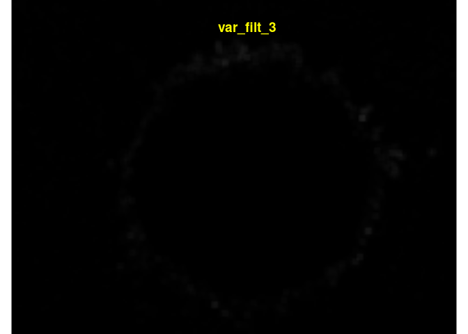
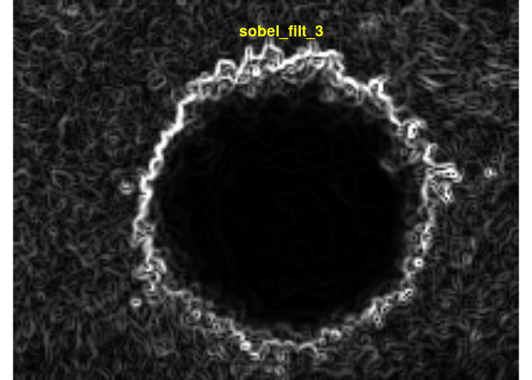
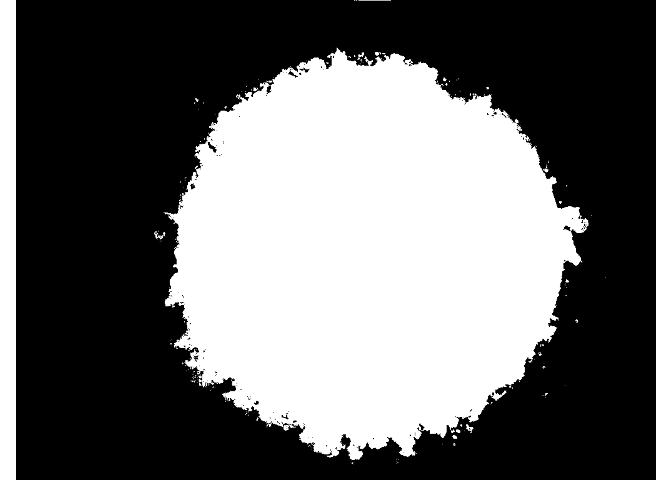

<!-- README.md is generated from README.Rmd. Please edit that file -->

# clasifierrr

<!-- badges: start -->

<!-- badges: end -->

The goal of clasifierrr is to …

## Installation

You can install the released version of clasifierrr from
[CRAN](https://CRAN.R-project.org) with:

``` r
install.packages("clasifierrr")
```

## Workflow

1.  Externally create the masking files for the classification
2.  Internally create a parameters data frame
3.  use `build_train_multi` to create the training dataset
4.  use `ranger` to train the classifier
5.  use `classify_img` to classify as many images as you want
6.  (optional) use `filter_masks` to remove objects that are too small
    or too big

## Example

``` r
library(clasifierrr)
library(EBImage)
library(ranger)
## basic example code
## 
## 
params_df <- tibble::tibble(
    file = c(
        system.file(
            "extdata", "4T1-shNT-1_layer1.png",
            package = "clasifierrr"),
        system.file(
            "extdata", "4T1-shNT-1_layer2.png",
            package = "clasifierrr")),
    classif = c("spheroid", "bg"),
    related_file = system.file(
        "extdata", "4T1-shNT-1.png",
        package = "clasifierrr")
)

params_df
#> # A tibble: 2 x 3
#>   file                              classif related_file                        
#>   <chr>                             <chr>   <chr>                               
#> 1 /home/jspaezp/R/x86_64-redhat-li… sphero… /home/jspaezp/R/x86_64-redhat-linux…
#> 2 /home/jspaezp/R/x86_64-redhat-li… bg      /home/jspaezp/R/x86_64-redhat-linux…
```

### Form of the classifier files

It has to be a file of the same size of the related image, where it is
all black except for the desired classifier section.

Several classifications can be used.

I personally use gimp to generate those, just open the image you want to
classify, draw on a new layer, disable the main layer and export to a
png.

``` r
display(readImageBw(system.file(
            "extdata", "4T1-shNT-1_layer1.png",
            package = "clasifierrr")), method = "raster")
```


``` r

display(readImageBw(system.file(
            "extdata", "4T1-shNT-1_layer2.png",
            package = "clasifierrr")), method = "raster")
```


``` r

base_image <- readImageBw(system.file(
            "extdata", "4T1-shNT-1.png",
            package = "clasifierrr"))
display(base_image, method = "raster")
```


The classifier is based on the concept of features, which is applying
several filters to the image to detect edges and calculate the
consistency with the neighborhood.

you can use as many filters as you want but THE FILTER WIDTHS HAVE TO BE
ODD NUMBERS, also consider that the more filters, the more memmory you
will need.

``` r

features <- calc_features(base_image, filter_widths = c(3,5))
head(features)
#> # A tibble: 6 x 7
#>   sobel_filt_3 sobel_filt_5 gauss_filt_3 gauss_filt_5 gauss_diff_3 y_position
#>          <dbl>        <dbl>        <dbl>        <dbl>        <dbl>      <dbl>
#> 1        0.851         2.08        0.477        0.477    -5.19e-11          0
#> 2        0.695         1.98        0.478        0.478    -5.53e-11          0
#> 3        0.687         1.76        0.478        0.478    -4.31e-11          0
#> 4        0.718         1.70        0.474        0.474    -4.14e-11          0
#> 5        0.761         1.68        0.474        0.474    -4.40e-11          0
#> 6        0.813         1.73        0.489        0.489    -5.69e-11          0
#> # … with 1 more variable: x_position <dbl>
```

Each of the columns can be made to an image

``` r
for (i in names(features)) {
    reconstructed_image <- Image(features[[i]], dim(base_image))
    display(reconstructed_image, method = "raster")
    title(main = list(i, col = "yellow"))
}
```



``` r
trainset <- build_train_multi(params_df)
#> [1] "Returning for file:  /home/jspaezp/R/x86_64-redhat-linux-gnu-library/3.6/clasifierrr/extdata/4T1-shNT-1_layer1.png and classification spheroid a total of 108470 positive pixels"
#> [1] "Returning for file:  /home/jspaezp/R/x86_64-redhat-linux-gnu-library/3.6/clasifierrr/extdata/4T1-shNT-1_layer2.png and classification bg a total of 205401 positive pixels"
#> 
#>       bg spheroid 
#>    32727    17273 
#> [1] 50000    14
head(trainset)
#>   sobel_filt_3 sobel_filt_5 sobel_filt_11 sobel_filt_23 gauss_filt_3
#> 1  0.007843137 1.240109e-02     0.1179734     0.7858221   0.06668160
#> 2  0.012401089 9.957420e-16     0.1664243     1.3248287   0.04318221
#> 3  0.047384494 1.286370e-01     0.8921375    10.1145610   0.23147768
#> 4  0.107109806 3.132595e-01     0.7594591     4.5800698   0.18438889
#> 5  0.106678200 3.212097e-01     1.5443713     9.5801490   0.43526414
#> 6  0.115802534 4.126787e-01     2.6900932     5.9372666   0.26666678
#>   gauss_filt_5 gauss_filt_11 gauss_filt_23  gauss_diff_3 gauss_diff_5
#> 1   0.06668160    0.06668160    0.06668160  1.711895e-12            0
#> 2   0.04318221    0.04318221    0.04318221  1.698426e-12            0
#> 3   0.23147768    0.23147768    0.23147768  1.383418e-11            0
#> 4   0.18438889    0.18438889    0.18438889  1.645825e-11            0
#> 5   0.43526414    0.43526414    0.43526414 -4.319489e-12            0
#> 6   0.26666678    0.26666678    0.26666678  2.664535e-14            0
#>   gauss_diff_11 y_position x_position pixel_class
#> 1             0 0.43847656 0.49739583    spheroid
#> 2             0 0.48632812 0.82682292    spheroid
#> 3             0 0.92187500 0.54557292          bg
#> 4             0 0.82324219 1.10026042          bg
#> 5             0 0.09570312 0.05729167          bg
#> 6             0 0.73632812 1.17317708          bg
```

``` r
classifier <- ranger(
    pixel_class ~ .,
    data = trainset, 
    num.trees = 100, 
    importance = "impurity")
classifier
#> Ranger result
#> 
#> Call:
#>  ranger(pixel_class ~ ., data = trainset, num.trees = 100, importance = "impurity") 
#> 
#> Type:                             Classification 
#> Number of trees:                  100 
#> Sample size:                      50000 
#> Number of independent variables:  13 
#> Mtry:                             3 
#> Target node size:                 1 
#> Variable importance mode:         impurity 
#> Splitrule:                        gini 
#> OOB prediction error:             0.43 %
```

If the classifier was trained using `importance = "impurity"`, you can
ask it to give you the relative importance of the variables used.

``` r
sort(ranger::importance(classifier), decreasing = TRUE)
#> gauss_filt_11  gauss_filt_3 gauss_filt_23  sobel_filt_5  gauss_filt_5 
#>     4160.6953     3667.3867     3120.9550     2981.6593     2926.4239 
#>  sobel_filt_3 sobel_filt_11 sobel_filt_23    x_position    y_position 
#>     1690.6570     1494.9016      866.9168      703.7202      594.4063 
#>  gauss_diff_3  gauss_diff_5 gauss_diff_11 
#>      403.9500        0.0000        0.0000
```

### Using the classifier on an image

Can be used directly on calculated features …

``` r
test_img <- readImageBw(system.file(
        "extdata", "4T1-shNT-1.png",
        package = "clasifierrr"))

test_feat <- calc_features(test_img)
class_img <- classify_img(
    classifier, 
    feature_frame = test_feat, 
    dims = dim(test_img))
#> Starting classification
#> Took 9.622 secs to predict the image
display(class_img, method = "raster")
```



It can also be used on a raw image …

``` r
class_img <- classify_img(classifier, img = test_img)
#> Attempting to calculate features
#> Starting classification
#> Took 9.37 secs to predict the image
display(class_img, method = "raster")
```


And as well in a system file

``` r
class_img <- classify_img(classifier, path = system.file(
        "extdata", "4T1-shNT-1.png",
        package = "clasifierrr"))
#> Attempting to read image from file
#> Attempting to calculate features
#> Starting classification
#> Took 9.347 secs to predict the image
display(class_img, method = "raster")
```


### Cleaning the final image

The final image can be cleaned manually or using `filter_masks`, which
can remove stuff either too big or small.

As a reminder, white regions are considered objects, so if your object
is black, try running something like `img <- 1- img`

``` r
display(dilate(class_img, makeBrush(3, "disc")), method = "raster")
```


``` r
display(colorLabels(bwlabel(class_img)), method = "raster")
```


``` r
filt_class_img <- filter_masks(class_img, min_radius = 30, max_radius = 1000)

display(
    filt_class_img,
    method = "raster")

display(colorLabels(bwlabel(filt_class_img)), method = "raster")
```


``` r

table(filt_class_img)
#> filt_class_img
#>      0      1 
#> 488102 298330

filt_class_img
#> Image 
#>   colorMode    : Grayscale 
#>   storage.mode : integer 
#>   dim          : 1024 768 
#>   frames.total : 1 
#>   frames.render: 1 
#> 
#> imageData(object)[1:5,1:6]
#>      [,1] [,2] [,3] [,4] [,5] [,6]
#> [1,]    0    0    0    0    0    0
#> [2,]    0    0    0    0    0    0
#> [3,]    0    0    0    0    0    0
#> [4,]    0    0    0    0    0    0
#> [5,]    0    0    0    0    0    0
```
