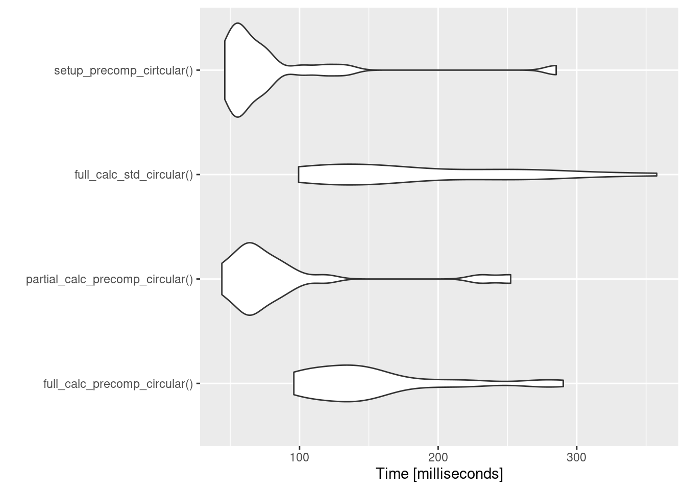
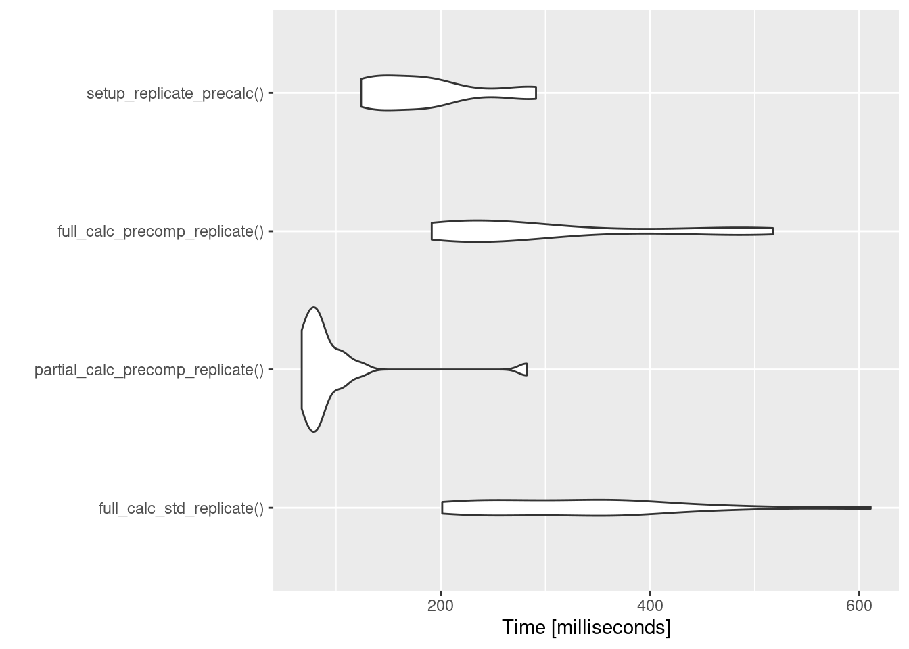
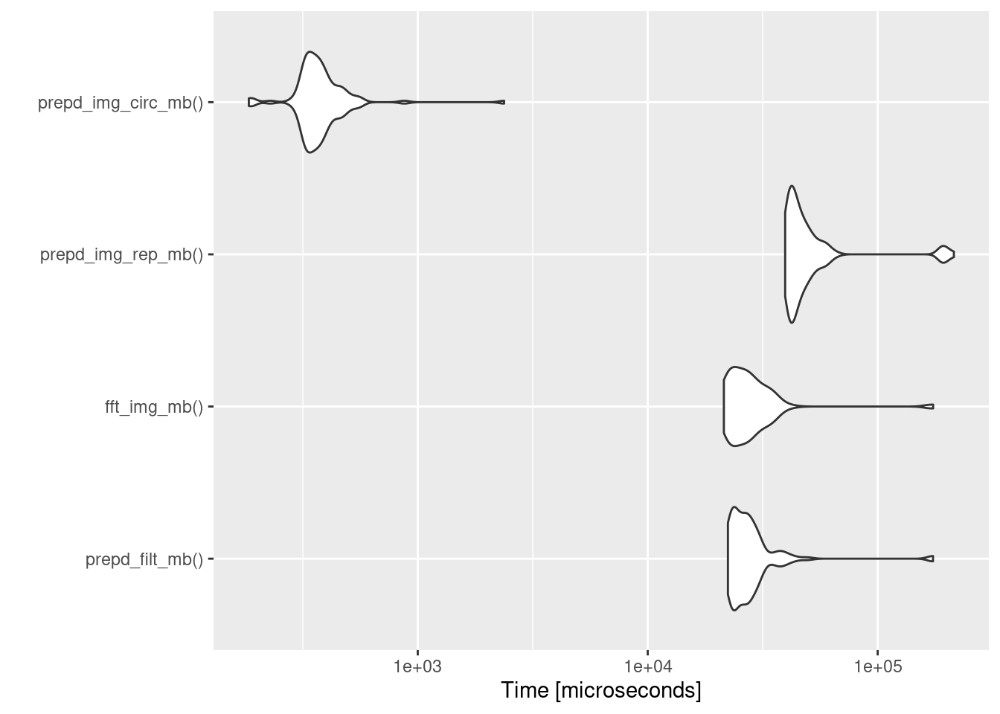
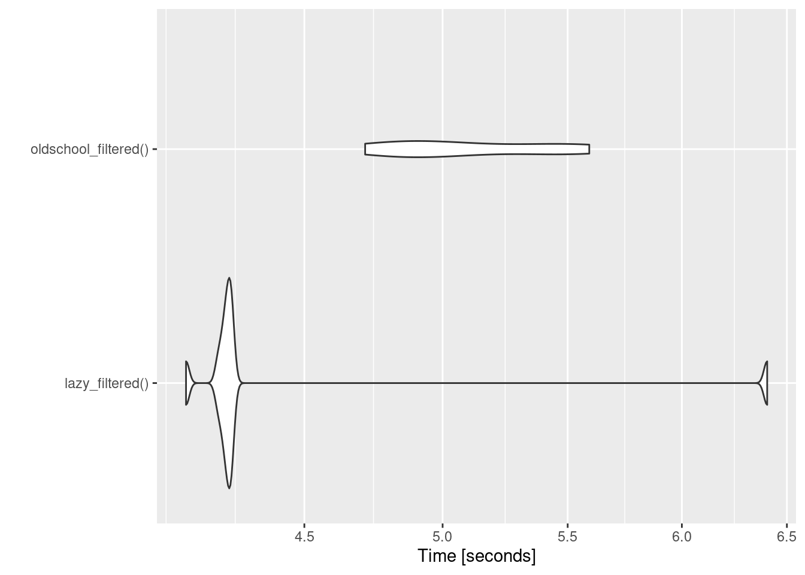
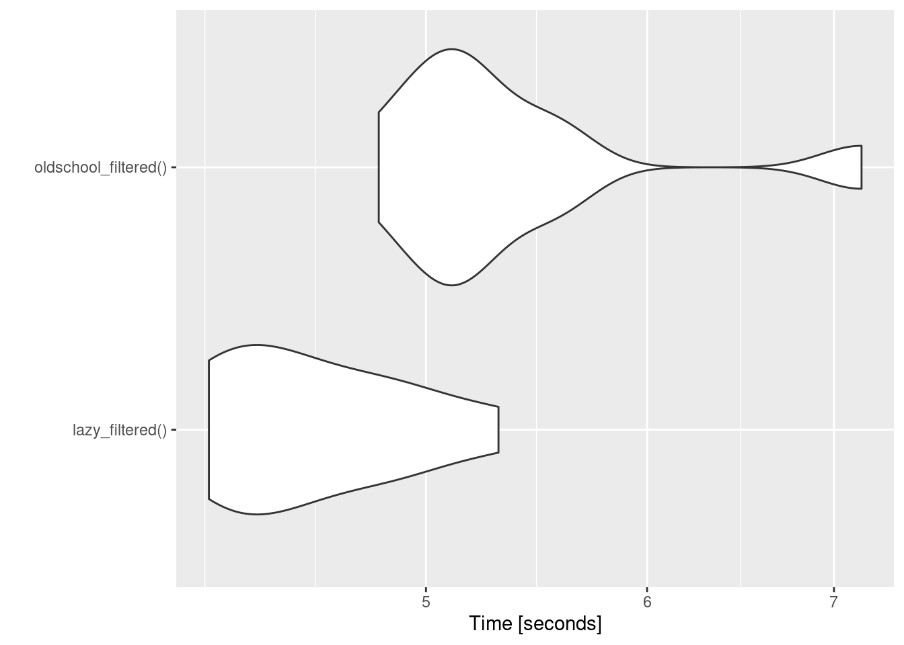

```r
devtools::load_all("../")
```

```
## Loading clasifierrr
```

```r
f = system.file("images", "sample.png", package = "EBImage")
f = system.file(
  "extdata", "4T1-shNT-1.png",
  package = "clasifierrr")
img = EBImage::readImage(f)
my_filter <- EBImage::makeBrush(31, "gaussian", sigma = 4)


full_calc_precomp_circular <- function() {
    prepd_filt <- prep_filter.filter(filter = my_filter, dim_x = dim(img))
    fft_img <- fftwtools::fftw2d(img)

    # Image preprocessing can be skiped if using circular to handle boundries...
    filtered_img <- filter2.prepared(
        prep_x = img,
        fft_x = fft_img,
        dims_x = dim(img),
        dims_x_orig = dim(img),
        x_dimnames = dimnames(img),
        prep_filter = prepd_filt)
    return(prepd_filt)
}

setup_precomp_cirtcular <- function(){
    prepd_filt <- prep_filter.filter(filter = my_filter, dim_x = dim(img))
    fft_img <- fftwtools::fftw2d(img)

}

prepd_filt <- prep_filter.filter(filter = my_filter, dim_x = dim(img))
fft_img <- fftwtools::fftw2d(img)

partial_calc_precomp_circular <- function() {
    filtered_img <- filter2.prepared(
        prep_x = img,
        fft_x = fft_img,
        dims_x = dim(img),
        dims_x_orig = dim(img),
        x_dimnames = dimnames(img),
        prep_filter = prepd_filt)
    return(prepd_filt)

}

full_calc_std_circular <- function() {
    oldschool_filtered <- EBImage::filter2(img, my_filter)
}

full_calc_precomp_replicate <- function() {

    prepd_img <- prep_filter.img(
        img, filter_dims = dim(my_filter),
        boundary = "replicate")

    prepd_filt <- prep_filter.filter(filter = my_filter, dim_x_proc = attr(prepd_img, "dx"))

    fft_img <- fftwtools::fftw2d(prepd_img)

    filtered_img <- filter2.prepared(
        prep_x = prepd_img,
        raw_x = img,
        fft_x = fft_img,
        dims_x = attr(prepd_img, "dx"),
        dims_x_orig = attr(prepd_img, "d"),
        prep_filter = prepd_filt,
        boundary = "replicate")

   return(filtered_img)
}


setup_replicate_precalc <- function() {
    prepd_img_rep <- prep_filter.img(
        img, filter_dims = dim(my_filter),
        boundary = "replicate")
    prepd_filt_rep <- prep_filter.filter(
        filter = my_filter, dim_x_proc = attr(prepd_img_rep, "dx"))
    fft_img_rep <- fftwtools::fftw2d(prepd_img_rep)

}


prepd_img_rep <- prep_filter.img(
    img, filter_dims = dim(my_filter),
    boundary = "replicate")
prepd_filt_rep <- prep_filter.filter(filter = my_filter, dim_x_proc = attr(prepd_img_rep, "dx"))
fft_img_rep <- fftwtools::fftw2d(prepd_img_rep)


partial_calc_precomp_replicate <- function() {
    filtered_img <- filter2.prepared(
        prep_x = prepd_img_rep,
        raw_x = img,
        fft_x = fft_img_rep,
        dims_x = attr(prepd_img_rep, "dx"),
        dims_x_orig = attr(prepd_img_rep, "d"),
        prep_filter = prepd_filt_rep,
        boundary = "replicate")

   return(filtered_img)
}


full_calc_std_replicate <- function() {
  oldschool_filtered <- EBImage::filter2(img, my_filter, boundary = "replicate")
  return(oldschool_filtered)
}


require(microbenchmark)
```

```
## Loading required package: microbenchmark
```

```r
mb1 <- microbenchmark::microbenchmark(
    full_calc_precomp_circular(),
    partial_calc_precomp_circular(),
    full_calc_std_circular(),
    setup_precomp_cirtcular(),
    times = 20
)


mb2 <- microbenchmark::microbenchmark(
    full_calc_std_replicate(),
    partial_calc_precomp_replicate(),
    full_calc_precomp_replicate(),
    setup_replicate_precalc(),
    times = 20
)

require(ggplot2)
```

```
## Loading required package: ggplot2
```

```r
mb1
```

```
## Unit: milliseconds
##                             expr      min        lq      mean    median
##     full_calc_precomp_circular() 95.87648 117.36052 154.24492 141.03843
##  partial_calc_precomp_circular() 43.94463  60.73837  87.32866  66.90297
##         full_calc_std_circular() 99.30703 119.03152 182.12342 157.66211
##        setup_precomp_cirtcular() 46.04921  54.13118  79.99371  60.05888
##         uq      max neval cld
##  168.45121 290.2663    20   b
##   86.53140 252.3580    20  a 
##  247.89631 357.7580    20   b
##   76.26002 285.1708    20  a
```

```r
mb2
```

```
## Unit: milliseconds
##                              expr       min        lq      mean    median
##         full_calc_std_replicate() 201.47074 247.53105 329.93326 333.03598
##  partial_calc_precomp_replicate()  67.17131  72.07227  94.78744  81.59566
##     full_calc_precomp_replicate() 191.39450 212.92158 299.98455 258.86342
##         setup_replicate_precalc() 123.92124 139.72653 184.17770 177.89235
##         uq      max neval cld
##  378.64002 610.8983    20   c
##   96.23872 282.1484    20 a  
##  358.69187 517.4452    20   c
##  204.09020 291.0714    20  b
```

```r
autoplot(mb1, log = FALSE)
```

```
## Coordinate system already present. Adding new coordinate system, which will replace the existing one.
```



```r
autoplot(mb2, log = FALSE)
```

```
## Coordinate system already present. Adding new coordinate system, which will replace the existing one.
```



```r
prepd_filt_mb = function() { prep_filter.filter(filter = my_filter, dim_x = dim(img)) }
fft_img_mb = function() { fftwtools::fftw2d(img) }
prepd_img_rep_mb = function() { prep_filter.img( img, filter_dims = dim(my_filter), boundary = "replicate") }
prepd_img_circ_mb = function() { prep_filter.img( img, filter_dims = dim(my_filter), boundary = "circular") }

mb3 <- microbenchmark(
    prepd_filt_mb(),
    fft_img_mb(),
    prepd_img_rep_mb(),
    prepd_img_circ_mb(),
    times = 100
)

autoplot(mb3, log = TRUE)
```

```
## Coordinate system already present. Adding new coordinate system, which will replace the existing one.
```



```r
mb3
```

```
## Unit: microseconds
##                 expr       min        lq       mean    median         uq
##      prepd_filt_mb() 22324.476 23575.041 30284.2400 26483.853 29273.9095
##         fft_img_mb() 21437.328 22911.683 30082.1259 26358.808 30740.8050
##   prepd_img_rep_mb() 39592.640 41649.726 56624.1877 44827.611 50524.8920
##  prepd_img_circ_mb()   184.273   328.804   395.9996   361.167   403.7305
##         max neval cld
##  174026.128   100  b 
##  174213.387   100  b 
##  214437.875   100   c
##    2374.305   100 a
```

```r
large_img <- EBImage::abind(purrr::map(1:16, ~ img), along = 1)

lazy_filtered <- function() { lazy_filter2(large_img, my_filter, boundary = "replicate") }
oldschool_filtered <- function() { EBImage::filter2(large_img, my_filter, boundary = "replicate") }

system.time({
  lazy_filtered()
})
```

```
##    user  system elapsed 
##   6.347   1.453   7.941
```

```r
system.time({
  lazy_filtered()
})
```

```
##    user  system elapsed 
##   3.352   0.731   4.129
```

```r
oldschool_filtered()
```

```
## Image 
##   colorMode    : Grayscale 
##   storage.mode : double 
##   dim          : 16384 768 
##   frames.total : 1 
##   frames.render: 1 
## 
## imageData(object)[1:5,1:6]
##           [,1]      [,2]      [,3]      [,4]      [,5]      [,6]
## [1,] 0.4913741 0.4952931 0.4995293 0.5036975 0.5073236 0.5099179
## [2,] 0.4907209 0.4942618 0.4981304 0.5019739 0.5053500 0.5077955
## [3,] 0.4902481 0.4933710 0.4968289 0.5003043 0.5033894 0.5056505
## [4,] 0.4900350 0.4927227 0.4957484 0.4988301 0.5015952 0.5036400
## [5,] 0.4901019 0.4923619 0.4949580 0.4976414 0.5000727 0.5018768
```

```r
memoise::forget(clasifierrr::mem_fft)
```

```
## [1] TRUE
```

```r
memoise::forget(clasifierrr::mem_prep_filter.img)
```

```
## [1] TRUE
```

```r
mb4 <- microbenchmark(
  lazy_filtered(),
  oldschool_filtered(),
  times = 10
)

mb5 <- microbenchmark(
  lazy_filtered(),
  oldschool_filtered(),
  times = 10
)


autoplot(mb4, log = TRUE)
```

```
## Coordinate system already present. Adding new coordinate system, which will replace the existing one.
```



```r
mb4
```

```
## Unit: seconds
##                  expr      min       lq     mean   median       uq      max
##       lazy_filtered() 4.112003 4.228335 4.445485 4.245855 4.255182 6.403083
##  oldschool_filtered() 4.713383 4.864703 5.110042 5.010859 5.475811 5.591207
##  neval cld
##     10  a 
##     10   b
```

```r
autoplot(mb5, log = TRUE)
```

```
## Coordinate system already present. Adding new coordinate system, which will replace the existing one.
```



```r
mb5
```

```
## Unit: seconds
##                  expr      min       lq     mean   median       uq      max
##       lazy_filtered() 4.180452 4.230175 4.569708 4.465282 4.880108 5.308091
##  oldschool_filtered() 4.809054 5.022944 5.372525 5.157685 5.541144 7.160868
##  neval cld
##     10  a 
##     10   b
```


---
title: "precomputed_filter.R"
author: "jspaezp"
date: "2020-02-12"
---

